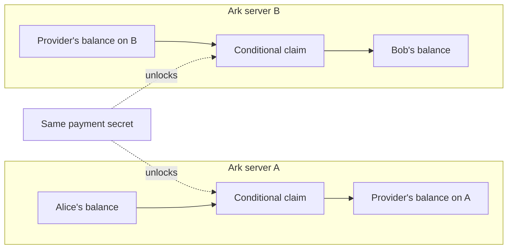

# A payment between two Ark servers

This describes the intended swap. It is not a live feature.
Example: Alice sends Bob 10,000 sats. Fees are separate and quoted before approval.

## Before the payment

Alice has a balance backed by Ark server A. Bob uses Ark server B.
A liquidity provider has a balance on B and agrees to exchange it for a balance
on A. The provider can be an operator or an independent participant.

The provider exchanges balances. No coins teleport between the servers, and
neither server must accept an unsecured promise from the other.

## Success

1. Bob's wallet creates a secret. It shares only its hash.
2. The provider reserves enough inventory on B. Alice approves the complete fee.
3. Alice's source claim and Bob's destination claim are signed with that same
   hash. Each participant verifies the full recovery package before committing.
4. Bob saves a valid claim on B, then reveals the secret to claim the payment.
5. The provider uses that secret to collect the corresponding claim on A.

| Participant | Change on A | Change on B |
| --- | --- | --- |
| Alice | Pays 10,000 sats plus quoted charges | None |
| Provider | Receives the agreed source amount | Supplies 10,000 sats plus applicable destination costs |
| Bob | None | Receives 10,000 sats net |

These are economic amounts, not an implemented fee schedule. Charges must cover
the actual recovery, refresh, and inventory costs. Opposite-direction swaps help
rebalance inventory. Sustained one-way payments require other rebalancing.

## Failure

If no secret is released, the provider and Alice recover through their respective
timeout paths. Refunds are not instantaneous. Actual timelocks and confirmations
control when they can spend. If a server stops cooperating, participants need
valid emergency-exit transactions and enough time and fees to confirm them.

If Bob already claimed, the provider must collect using the revealed secret.
It must not blindly refund Alice because a status request timed out. Monitoring
and reorg handling are essential. A late success spend can race a refund spend;
the nominal timeout does not disable the hashlock branch.

## What has been tested

- Two persistent simulated ledgers: reservations, settlement, refunds, and restart.
- Actual XBT regtest contracts: signatures, hashlocks, refunds, CSV ancestry,
  restart, and a one-block reorg.
- Actual signed VTXO builders: two distinct server identities, transaction-graph
  validation, incorrect signer rejection, and preimage validation.

The VTXO test confirms that existing Lightning policies remain local-server
contracts. A matching payment hash does not turn them into a direct swap. A new
policy must encode the independent swap claimant and preserve the local server's
co-signing and recovery rules. Full two-server settlement remains unimplemented.
